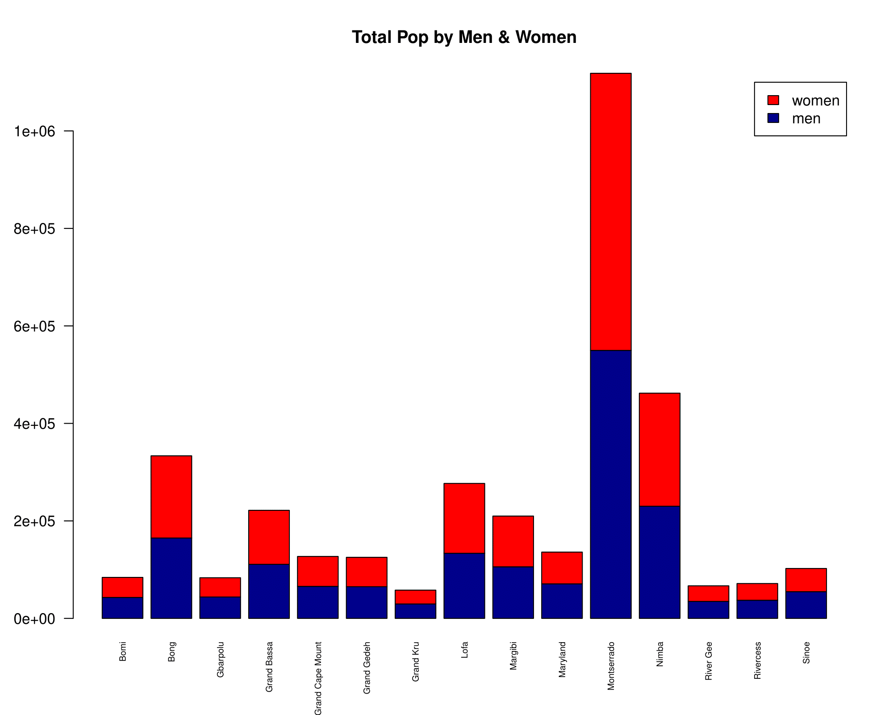
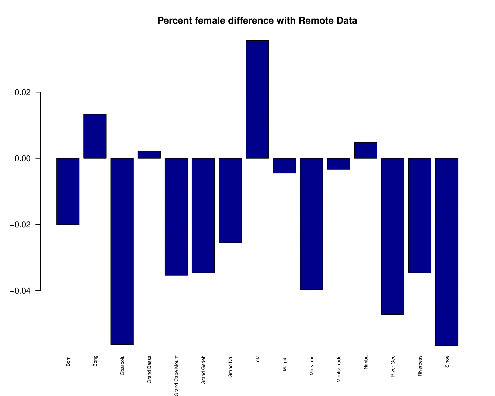
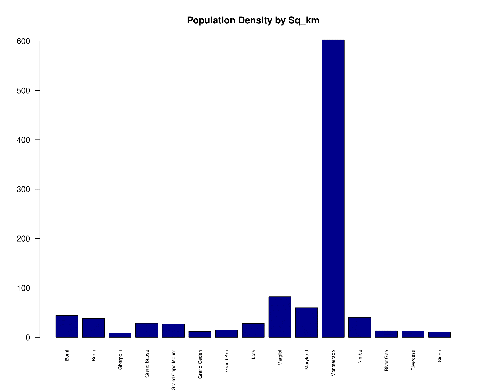
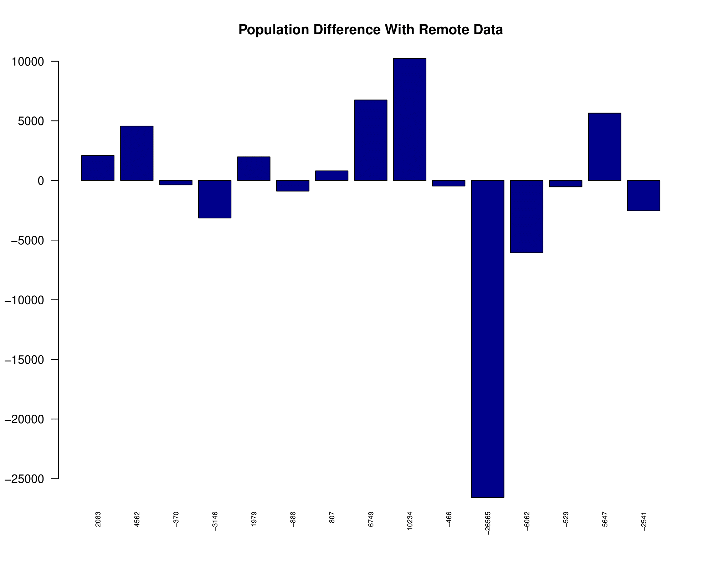

#Task4

Given two sets of Liberia counties I created various plots that visualize the remote 
and source data. I learned how to import, reorganize, modify, and export data with R Plots.

Bar Graphs

