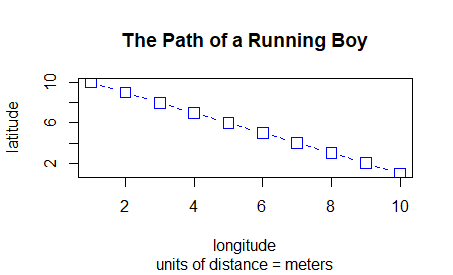

#Task3


I continued my work on Task2 with a larger and more populated plot. To meet the challenge 
requirements I increased the amount of trees, houses, and houses connected with curves. 
Using the same concepts in Task2 and editing numerical values I increased the complexity
of the plot in Task2.



```
# sets plot 1000x1000

x <- 1:1000
y <- 1:1000

plot(x, y, type = "o", 
     main = "The Path of a Running Boy",
     sub = "units of distance = meters",
     xlab = "longitude", 
     ylab = "latitude")

plot(x, y, type = "b", main = "The Path of a Running Boy", 
     sub = "units of distance = meters", 
     xlab = "longitude", 
     ylab = "latitude",
     lty = 2,
     lwd = .75,
     col = "blue",
     pch = 0,
     cex = 1.5)

## adds 40 squares

east <- sample(x, size = 50, replace = TRUE)
north <- sample(y, size = 50, replace = TRUE)

symbols(east, north, squares = rep(7.5,50), inches = FALSE)


## adds circles small trees

symbols(sample(x, 40, replace = TRUE), 
        sample(y, 40, replace = TRUE), 
        circles = rep(8.5,40), 
        inches = FALSE,
        fg = "green",
        add = TRUE)

## adds circles big trees

symbols(sample(x, 12, replace = TRUE), 
        sample(y, 12, replace = TRUE), 
        circles = rep(15,12), 
        inches = FALSE,
        fg = "green4",
        bg = "beige",
        add = TRUE)
## adds data frame object class

dwellings <- cbind.data.frame(id = 1:10, east, north)

## adds blue lines to squares

#lines(x = dwellings$east,
      y = dwellings$north,
      lty = 2,
      lwd = .75,
      col = "blue")


## set 7 houses only

locs <- sample(1:10, 7, replace = FALSE)

#lines(x = dwellings[locs, 2],
      y = dwellings[locs, 3],
      lty = 2,
      lwd = .75,
      col = "blue")
      
 ## labels squares

text(x = dwellings[locs, ]$east, 
     y = dwellings[locs, ]$north + 30,
     labels = dwellings[locs, ]$id)
 
 ## spline

xspline(x = dwellings[locs, 2],
        y = dwellings[locs, 3],
        shape = -1,
        lty = 2)


##title

title(main="A Person's path between Homes")


```


