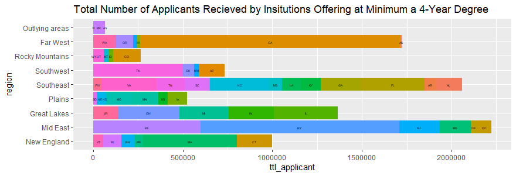
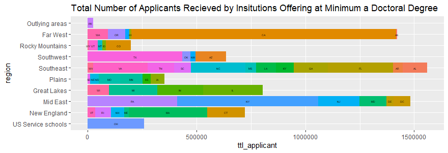
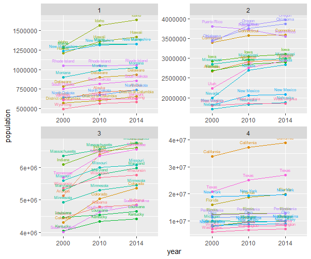

# Project1

## Part 1 
Creating Bar graphs of 4yr and doctoral degree institutions by total applicants. 
Visualized state breakdown of total applicants by region. 

## Part 2
Used an API to retrieve data from 2000,2010,2014 Censuses. Divided state populations by quartile 
plotted 4 graphs over time. 

