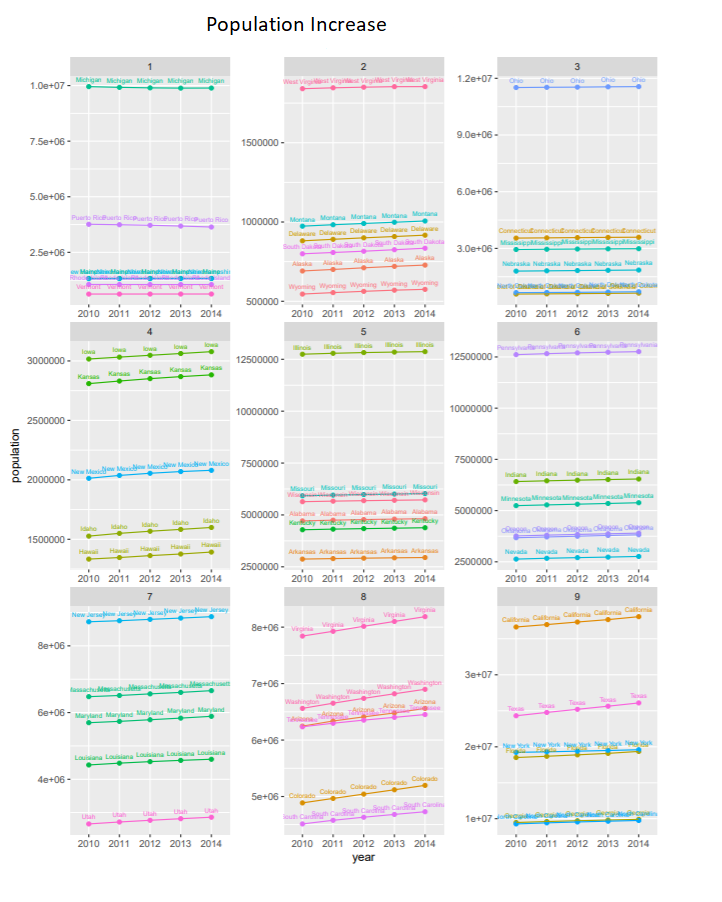

# Project 2

## Part 1 Population Changes

Population Increase 2010-2014

Average Growth Rate 2010-2014

## Part 2 Stock Predictor
Matrix Model

Model 1 
~~~
> model_RCL <- buildModel(specs_RCL, method="lm",
+                        training.per=c('2020-02-10' , ' 2020-9-10'))
> summary(model_RCL)

quantmod object:   lm1601258039.17314 	Build date:  2020-09-27 21:53:59 

Model Specified: 
     Next(Cl(RCL)) ~ Cl(CCL) 

Model Target:  Next.Cl.RCL 		 Product:  RCL 
Model Inputs:  Cl.CCL 

Fitted Model: 

	Modelling procedure:  lm 
	Training window:  149  observations from  2020-02-10 to 2020-09-10

Call:
lm(formula = quantmod@model.formula, data = training.data)

Residuals:
     Min       1Q   Median       3Q      Max 
-31.6160  -6.3631  -0.4652   5.5236  20.1998 

Coefficients:
            Estimate Std. Error t value Pr(>|t|)    
(Intercept)  15.6593     1.9936   7.855 7.74e-13 ***
Cl.CCL        2.1254     0.1009  21.065  < 2e-16 ***
---
Signif. codes:  0 ‘***’ 0.001 ‘**’ 0.01 ‘*’ 0.05 ‘.’ 0.1 ‘ ’ 1

Residual standard error: 10 on 147 degrees of freedom
Multiple R-squared:  0.7512,	Adjusted R-squared:  0.7495 
F-statistic: 443.8 on 1 and 147 DF,  p-value: < 2.2e-16
~~~

Model 2 
~~~

> model_RCL2 <- buildModel(specs_RCL2, method="lm",
+                          training.per=c('2020-02-10' , ' 2020-9-10'))
> summary(model_RCL2)

quantmod object:   lm1601258145.63949 	Build date:  2020-09-27 21:55:45 

Model Specified: 
     Next(Cl(RCL)) ~ Cl(CCL) + Cl(CUK) + Cl(DWSH) + Cl(NCLH) + Cl(LIND) 

Model Target:  Next.Cl.RCL 		 Product:  RCL 
Model Inputs:  Cl.CCL, Cl.CUK, Cl.DWSH, Cl.NCLH, Cl.LIND 

Fitted Model: 

	Modelling procedure:  lm 
	Training window:  149  observations from  2020-02-10 to 2020-09-10

Call:
lm(formula = quantmod@model.formula, data = training.data)

Residuals:
     Min       1Q   Median       3Q      Max 
-13.3998  -2.9901  -0.6512   3.1836  13.7626 

Coefficients:
            Estimate Std. Error t value Pr(>|t|)    
(Intercept) 26.73360    5.50614   4.855 3.11e-06 ***
Cl.CCL      -2.52578    0.77179  -3.273  0.00134 ** 
Cl.CUK      -0.07837    0.79276  -0.099  0.92139    
Cl.DWSH     -0.34009    0.14152  -2.403  0.01754 *  
Cl.NCLH      2.68348    0.25950  10.341  < 2e-16 ***
Cl.LIND      4.11120    0.57571   7.141 4.31e-11 ***
---
Signif. codes:  0 ‘***’ 0.001 ‘**’ 0.01 ‘*’ 0.05 ‘.’ 0.1 ‘ ’ 1

Residual standard error: 4.557 on 143 degrees of freedom
Multiple R-squared:  0.9497,	Adjusted R-squared:  0.948 
F-statistic: 540.5 on 5 and 143 DF,  p-value: < 2.2e-16
~~~

Model 3 
~~~
> summary(model_RCL3)

quantmod object:   lm1601306713.84387 	Build date:  2020-09-28 11:25:13 

Model Specified: 
     Delt(Next(Cl(RCL))) ~ Delt(Cl(CCL)) + Delt(Cl(CUK)) + Delt(Cl(DWSH)) +   Delt(Cl(NCLH)) + Delt(Cl(LIND)) 

Model Target:  Delt.Next.Cl.RCL 		 Product:  RCL 
Model Inputs:  Delt.Cl.CCL, Delt.Cl.CUK, Delt.Cl.DWSH, Delt.Cl.NCLH, Delt.Cl.LIND 

Fitted Model: 

	Modelling procedure:  lm 
	Training window:  149  observations from  2020-02-10 to 2020-09-10

Call:
lm(formula = quantmod@model.formula, data = training.data)

Residuals:
      Min        1Q    Median        3Q       Max 
-0.264495 -0.041180 -0.003291  0.042111  0.218798 

Coefficients:
              Estimate Std. Error t value Pr(>|t|)  
(Intercept)   0.001456   0.007070   0.206   0.8371  
Delt.Cl.CCL  -0.235843   0.462622  -0.510   0.6110  
Delt.Cl.CUK   0.162250   0.492917   0.329   0.7425  
Delt.Cl.DWSH  0.213910   0.327373   0.653   0.5145  
Delt.Cl.NCLH  0.273167   0.147866   1.847   0.0668 .
Delt.Cl.LIND  0.026174   0.123198   0.212   0.8321  
---
Signif. codes:  0 ‘***’ 0.001 ‘**’ 0.01 ‘*’ 0.05 ‘.’ 0.1 ‘ ’ 1

Residual standard error: 0.08566 on 143 degrees of freedom
Multiple R-squared:  0.04165,	Adjusted R-squared:  0.00814 
F-statistic: 1.243 on 5 and 143 DF,  p-value: 0.2922
~~~
