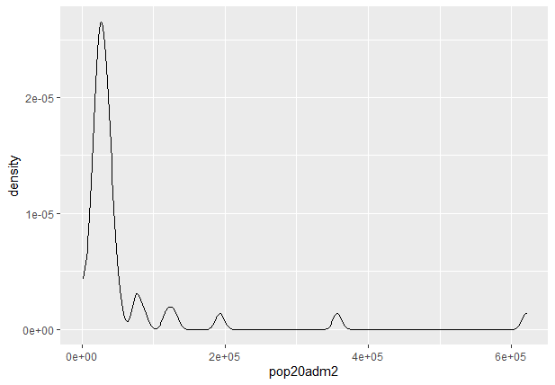

# Project 5 Acquiring, Modifying and Describing the Data

## 
Plot of layer 12 Slope

## 
Plot of layer 8 (dst160 = Tree cover, flooded, fresh or brakish water)

## 
Plot of layer 10  (dst200 = Bare areas)

## 
Plot of Population Histogram 

## 
Plot of Population Density with geom_density()

## 
Plot of Filled in Population Density Histogram.

## 
Plot of NTL density

